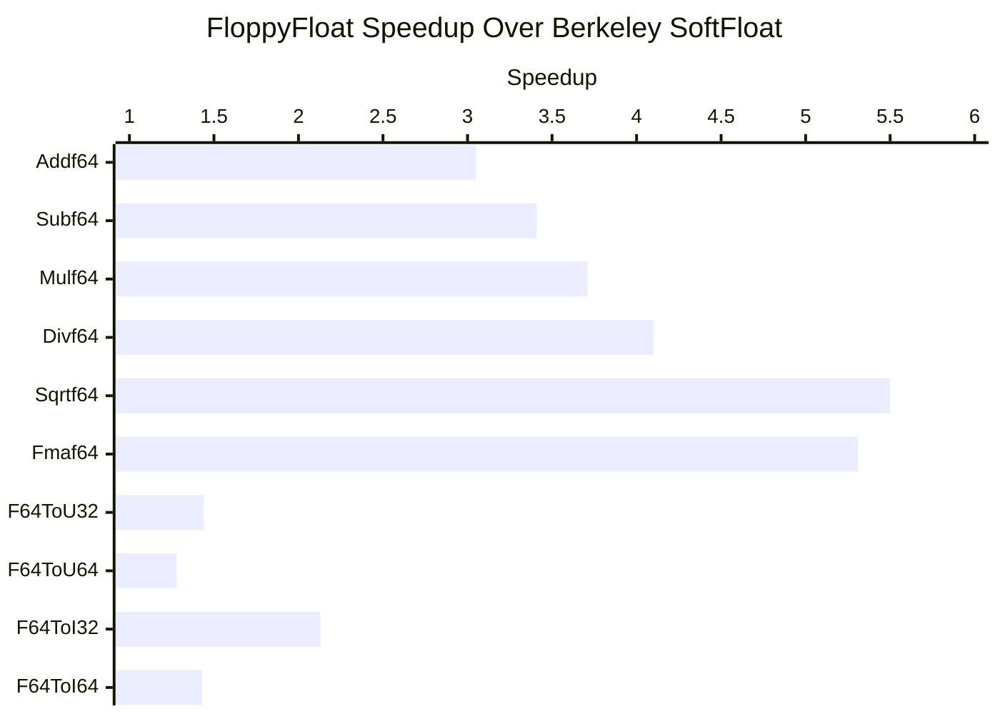

# FloppyFloat

A floating point library for instruction set simulators.

## What Can It Be Used For?
FloppyFloat is primarily designed as a faster alternative to soft float libraries in simulator environments.
Soft float libraries, such as [Berkeley SoftFloat](https://github.com/ucb-bar/berkeley-softfloat-3) or [SoftFP](https://bellard.org/softfp/),
compute floating point instructions purely by integer arithmetic, which is a slow and painful process.
As most computers come with an FPU, computing results and exception flags by floating point arithmetic is way faster.
This is why FloppyFloat uses the host's FPU most of the time, and only resorts to software rectifications in some corner cases.

FloppyFloat only relies on correct IEEE 754 floating point results in round to nearest mode.
It's not relying on floating point exceptions flags, particular NaN values, rounding modes, tininess detection before or after rounding, and so forth.
Hence, you could even use it on systems like the [XuanTie C910](https://www.riscfive.com/2023/03/09/t-head-xuantie-c910-risc-v/),
which break IEEE 754 compliance by not setting floating point exception flags in certain cases.

Currently, FloppyFloat is able to mimic x86 SSE, ARM64, and RISC-V FP characteristics.
It should work on several host systems (the system that is executing the simulation), including x86, ARM, RISC-V, PowerPC, etc.
FloppyFloat also does not rely on global state/variables, which allows it to easily model heterogeneous systems.

## How Much Faster Is It?
That pretty much depends on the used hardware, the executed instructions and rounding modes, and status of the exception flags.
Assuming a likely scenario with RoundTiesToEven, you should get the following results on an AMD Threadripper 3990X:


In general, heavy arithmetic instructions (e.g., Sqrtf64) see greater speedups than lightweight comparison or conversion instructions (e.g., F64ToU32).

## Features
The following table shows FloppyFloat functions and their corresponding ISA instructions.

| FloatFunction        | RISC-V    | x86 SSE     | ARM64  |
|----------------------|-----------|-------------|--------|
| Add\<f16\>           | FADD.H    | -           | FADD   |
| Sub\<f16\>           | FSUB.H    | -           | FSUB   |
| Mul\<f16\>           | FMUL.H    | -           | FMUL   |
| Div\<f16\>           | FDIV.H    | -           | FDIV   |
| Sqrt\<f16\>          | FSQRT.H   | -           | FSQRT  |
| Fma\<f16\>           | FMADD.H   | -           | FMADD  |
| Eq\<f16\>            | FEQ.H     | -           | (3)    |
| Lt\<f16\>            | FLT.H     | -           | (3)    |
| Le\<f16\>            | FLE.H     | -           | (3)    |
| F16ToI32             | FCVT.W.H  | -           | FCVTxS |
| F16ToI64             | FCVT.L.H  | -           | FCVTxS |
| F16ToU32             | FCVT.WU.H | -           | FCVTxU |
| F16ToU64             | FCVT.LU.H | -           | FCVTxU |
| F16ToF32             | FCVT.S.H  | -           | FCVT   |
| F16ToF64             | FCVT.D.H  | -           | FCVT   |
| Class\<f16\>         | FCLASS.H  | (6)         | -      |
| MaximumNumber\<f16\> | FMAX.H    | -           | (4)    |
| MinimumNumber\<f16\> | FMIN.H    | -           | (4)    |
| Add\<f32\>           | FADD.S    | ADDSS       | FADD   |
| Sub\<f32\>           | FSUB.S    | SUBSS       | FSUB   |
| Mul\<f32\>           | FMUL.S    | MULSS       | FMUL   |
| Div\<f32\>           | FDIV.S    | DIVSS       | FDIV   |
| Sqrt\<f32\>          | FSQRT.S   | SQRTSS      | FSQRT  |
| Fma\<f32\>           | FMADD.S   | VFMADDxxxSS | FMADD  |
| F32ToI32             | FCVT.W.S  | CVTSS2SI    | FCVTxS |
| F32ToI64             | FCVT.L.S  | CVTSS2SI    | FCVTxS |
| F32ToU32             | FCVT.WU.S | (1)         | FCVTxU |
| F32ToU64             | FCVT.LU.S | (1)         | FCVTxU |
| F32ToF16             | FCVT.H.S  | -           | FCVT   |
| F32ToF64             | FCVT.D.S  | CVTSS2SD    | FCVT   |
| I32ToF16             | FCVT.H.W  | -           | SCVTF  |
| I32ToF32             | FCVT.S.W  | CVTSI2SS    | SCVTF  |
| I32ToF64             | FCVT.D.W  | CVTSI2SD    | SCVTF  |
| U32ToF16             | FCVT.H.WU | -           | UCVTF  |
| U32ToF32             | FCVT.S.WU | -           | UCVTF  |
| U32ToF64             | FCVT.D.WU | -           | UCVTF  |
| Class\<ff32\>        | FCLASS.S  | (6)         | -      |
| Eq\<f32\>            | FEQ.S     | (2)         | (3)    |
| Lt\<f32\>            | FLT.S     | (2)         | (3)    |
| Le\<f32\>            | FLE.S     | (2)         | (3)    |
| MaximumNumber\<f32\> | FMAX.S    |             | (4)    |
| MinimumNumber\<f32\> | FMIN.S    |             | (4)    |
| MaxX86\<f32\>        |           | MAXSS       |        |
| MinX86\<f32\>        |           | MINSS       |        |
| Add\<f64\>           | FADD.D    | ADDSD       | FADD   |
| Sub\<f64\>           | FSUB.D    | SUBSD       | FSUB   |
| Mul\<f64\>           | FMUL.D    | MULSD       | FMUL   |
| Div\<f64\>           | FDIV.D    | DIVSD       | FDIV   |
| Sqrt\<f64\>          | FSQRT.D   | SQRTSD      | FSQRT  |
| Fma\<f64\>           | FMADD.D   | VFMADDxxxSD | FMADD  |
| F64ToI32             | FCVT.W.D  | CVTSD2SI    | FCVTxS |
| F64ToI64             | FCVT.L.D  | CVTSD2SI    | FCVTxS |
| F64ToU32             | FCVT.WU.D | (5)         | FCVTxU |
| F64ToU64             | FCVT.LU.D | (5)         | FCVTxU |
| F64ToF16             | FCVT.H.D  | -           | FCVT   |
| F64ToF32             | FCVT.S.D  | CVTSS2SD    | FCVT   |
| Eq\<f64\>            | FEQ.D     | (2)         | (3)    |
| Lt\<f64\>            | FLT.D     | (2)         | (3)    |
| Le\<f64\>            | FLE.D     | (2)         | (3)    |
| MaximumNumber\<f64\> | FMAX.D    |             | (4)    |
| MinimumNumber\<f64\> | FMIN.D    |             | (4)    |
| MaxX86\<f64\>        |           | MAXSD       |        |
| MinX86\<f64\>        |           | MINSD       |        |
| I64ToF16             | FCVT.H.L  | -           | SCVTF  |
| I64ToF32             | FCVT.S.L  | CVTSI2SS    | SCVTF  |
| I64ToF64             | FCVT.D.L  | CVTSI2SD    | SCVTF  |
| U64ToF16             | FCVT.H.LU | -           | UCVTF  |
| U64ToF32             | FCVT.S.LU | -           | UCVTF  |
| U64ToF64             | FCVT.D.LU | -           | UCVTF  |
| Class\<f64\>         | FCLASS.D  | (6)         | -      |

(1): Compiled code for x86 SSE resorts to CVTSS2SI for F32ToUxx.<br>
(2): x86 SSE uses UCOMISS to achieve a the same functionality.<br>
(3): ARM64 uses comparison functions (e.g., FCMP or FCMPE) which set bits in the PSTATE register.<br>
(4): ARM64 provides FMAXNM/FMINNM and FMAX/FMIN.<br>
(5): Compiled code for x86 SSE resorts to CVTSD2SI for F64ToUxx.<br>
(6): Only available in x86 AVX512 as VFPCLASSxx.<br>

## Build
FloppyFloat follows a vanilla CMake build process:
```bash
mkdir build
cd build
cmake ..
cmake --build . --target floppy_float_shared
cmake --build . --target floppy_float_static
```
After building you should obtain `libFloppyFloat.a` and `libFloppyFloat.so`.

Besides GoogleTest for testing, there are no third-party dependencies.
You only need a fairly recent compiler that supports at least C++23 and 128-bit datatypes.

## Usage
The following code highlights the usage of FloppyFloat using a predefined RISC-V setup.
Note that you can either use a dynamic rounding mode or a static rounding mode when executing the functions.
If you are using a dynamic rounding, the usage of the `FLOPPY_FLOAT_FUNC` macro is highly recommended if performance is of great concern.

```c++
#include <iostream>

#include "floppy_float.h"

using namespace FfUtils;

int main() {
  f32 a{5.5f}, b{3.25f}, result;

  FloppyFloat ff;
  ff.SetupToRiscv();
  ff.rounding_mode = FloppyFloat::kRoundTiesToEven;

  // Dynamic rounding mode - slow variant.
  result = ff.Mul<f32>(a, b);

  // Dynamic rounding mode - fast variant.
  FLOPPY_FLOAT_FUNC_2(result, ff.rounding_mode, ff.Mul, f32, a, b)

  // Static rounding mode.
  result = ff.Mul<f32, FloppyFloat::kRoundTiesToEven>(a, b);

  std::cout << a << " + " << b << " = " << result << std::endl;
}
```

Besides predefined setups, you can also freely configure many properties, such as NaN propagation schemes,
canonical qNaN values, tininess detection, etc.

```c++
FloppyFloat ff;
ff.nan_propagation_scheme = FloppyFloat::NanPropX86sse;
ff.SetQnan<f32>(0xffc00000);
ff.tininess_before_rounding = true;
```

## Things You Need To Take Care Of
If you are integrating FloppyFloat into a simulator, there are still some FP related things you need to take care of.
For RISC.V, this primarily concerns NaN boxing.

## How Does It Work?
Coding, algorithms, and a bit of math.
For a detailed explanation see [this blog post](https://www.chciken.com/simulation/2023/11/12/fast-floating-point-simulation.html).

## Issues
- ARM's FPCR.DN = 0 needs to be implemented.
- On x86 Windows systems without FMA extension, MSVC uses a broken `std::fma`, which also affects the results of FloppyFloat.
